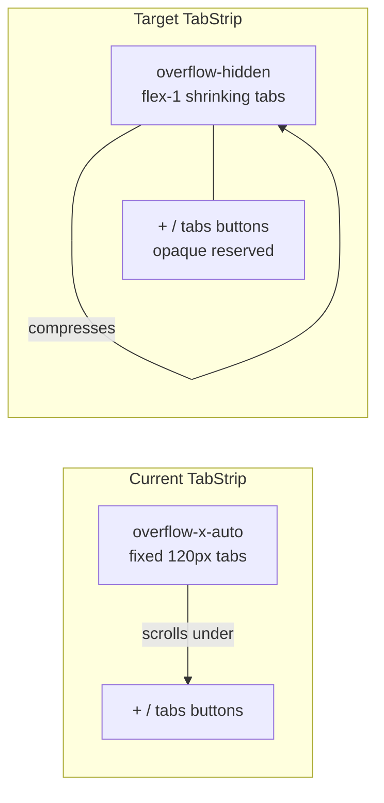

# Classic Layout & Flexible Tabs Polish

## Problem summary

Current classic tab strip ([`TabStrip.tsx`](src/renderer/components/browser/TabStrip.tsx)) uses fixed-width tabs (`min-w-[120px] flex-shrink-0`) inside an `overflow-x-auto` container with a non-existent `scrollbar-none` class. That produces a visible 6px horizontal scrollbar (from global styles in [`main.css`](src/renderer/assets/main.css)) and tabs that scroll behind the trailing +/tabs buttons instead of compressing.

Classic layout polish gaps span menus opening with wrong animation direction, inconsistent toolbar sizing, FindBar rendering behind chrome, and embedded window controls that look like a glass pill rather than native Win11 buttons.



---

## 1. Flexible tab strip (no horizontal scrollbar)

**File:** [`TabStrip.tsx`](src/renderer/components/browser/TabStrip.tsx)

Replace scroll-based overflow with Chrome-style flexible tabs:

- **Container:** change scroll area from `overflow-x-auto scrollbar-none` to `overflow-hidden flex` (no horizontal scroll at all).
- **Tab sizing:** replace `flex-shrink-0 min-w-[120px] max-w-[220px]` with `flex-1 basis-0 min-w-[40px] max-w-[220px]` so tabs share available width equally and shrink as count grows.
- **Dynamic width via ResizeObserver:** measure the tab container width (excluding the trailing +/tabs cluster), compute per-tab width as `clamp(40, available / tabCount, 220)`, and pass it as an inline `width`/`flexBasis` to each `TabStripItem`. This avoids fighting CSS flex minimums when many tabs are open.
- **Compact mode:** below ~72px per tab, hide title text and show favicon-only; below ~40px, show a minimal favicon chip. Keeps many tabs usable without overflow.
- **Active tab visibility:** when tab width hits minimum and count is high, use the existing `scrollRef` only for programmatic `scrollIntoView` on the active tab—not user-visible scrolling—or skip scroll entirely if flex handles it.
- **Trailing controls:** add an opaque background (`bg-inherit` / matching chrome surface) and `z-10` on the +/tabs button cluster so compressed tabs never visually bleed underneath.

**Layout shell:** verify [`ClassicBrowserChrome.tsx`](src/renderer/components/layout/ClassicBrowserChrome.tsx) keeps `flex-1 min-w-0` on the TabStrip wrapper and `flex-shrink-0` on the WindowControls column so tabs never compete with the 138px control area.

---

## 2. Windows 11-styled embedded window controls

**File:** [`WindowControls.tsx`](src/renderer/components/layout/WindowControls.tsx)

User preference: custom controls styled like Win11 (not `titleBarOverlay`).

For `embedded` mode (classic layout only):

- Remove the rounded glass pill wrapper (`rounded-lg backdrop-blur border`).
- Render a flat horizontal strip flush to the top-right: 3 buttons at **46×32px** (Win11 standard), no outer padding/gap, square edges on the group.
- Hover colors: `#E5E5E5` / `#3B3B3B` (dark) for minimize & maximize; `#C42B1C` with white icon for close.
- Icons: thinner stroke, smaller (10–11px), centered—closer to Segoe Fluent than the current chunky SVG set.
- Default state: transparent background, `#1A1A1A` / `#FFFFFF` icon color at ~70% opacity.
- Keep floating layout controls unchanged (hover-reveal pill at top-right).

Optional: expose `platform` via preload (`process.platform`) if we want macOS/Linux variants later; for now scope to Win11 styling since you're on Windows.

---

## 3. Fix menu & popover positioning

Several popovers use hardcoded `y: 10` on exit regardless of open direction, causing menus to animate the wrong way in floating layout and site info to feel misaligned in classic.

**Shared fix — new utility:** [`src/renderer/utils/popoverPosition.ts`](src/renderer/utils/popoverPosition.ts)

```ts
// Direction-aware animation offsets + viewport clamping
export function getPopoverMotion(popoverBelow: boolean) {
  const enterY = popoverBelow ? -10 : 10
  const exitY  = popoverBelow ? -10 : 10  // mirror enter direction
  return { enterY, exitY }
}

export function clampPopoverLeft(rect: DOMRect, popoverWidth: number): number {
  return Math.max(8, Math.min(rect.left + rect.width / 2, window.innerWidth - popoverWidth - 8))
}
```

**Apply to:**

| Component | Fix |
|-----------|-----|
| [`AppMenu.tsx`](src/renderer/components/layout/AppMenu.tsx) | Direction-aware exit `y`; clamp horizontal position so classic left-edge menu doesn't spill off-screen |
| [`SpaceSwitcher.tsx`](src/renderer/components/layout/SpaceSwitcher.tsx) | Same exit animation fix; clamp left offset |
| [`SiteInfoPopover.tsx`](src/renderer/components/browser/SiteInfoPopover.tsx) | Fix `initial`/`exit` y to respect `popoverBelow`; anchor to lock icon column (`left-0` + offset) instead of centering on full URL bar width in classic mode |
| [`DownloadPill.tsx`](src/renderer/components/browser/DownloadPill.tsx) | Verify `right-0` anchor; add viewport bottom clamp if dropdown would extend below window |
| [`TabStrip.tsx`](src/renderer/components/browser/TabStrip.tsx) | Tab list dropdown: ensure `right-0` alignment stays attached to tabs button; register in global click-away |

**Global click-away:** extend [`BrowserLayout.tsx`](src/renderer/components/layout/BrowserLayout.tsx) overlay to also close TabStrip's local `menuOpen` and DownloadPill's `isOpen` (lift TabStrip menu state to `uiStore` or pass a close callback)—eliminates z-index fights where chrome popovers stay open while webview receives clicks.

---

## 4. Classic chrome visual polish

**File:** [`ClassicBrowserChrome.tsx`](src/renderer/components/layout/ClassicBrowserChrome.tsx)

- **Toolbar height consistency:** normalize all toolbar buttons to `h-9 w-9` (AppMenu and SpaceSwitcher currently `h-10 w-10`, nav buttons `h-9`).
- **URL bar row:** add subtle rounded container (`rounded-lg bg-black/[0.03]`) for classic URL bar so it reads as a distinct address field (matches browser conventions).
- **Active tab connection:** active tab already uses white/dark surface—add a `border-b-2 border-transparent` on inactive tabs and remove bottom border on active tab so it visually merges into the toolbar row below.
- **Window controls row alignment:** align embedded controls to top of tab strip row (`items-start` + `h-8` strip) so they sit at the Win11 title-bar position, not vertically centered in the tab row.
- **Drag region:** extend `[app-region:drag]` to the empty space right of tabs but left of window controls (currently only the outer row is draggable; inner TabStrip is `no-drag`).

**File:** [`FindBar.tsx`](src/renderer/components/browser/FindBar.tsx)

- Raise z-index from `z-[25]` to `z-[90]` so it renders above classic chrome (`z-[85]`) while staying below modals/toasts.

**File:** [`main.css`](src/renderer/assets/main.css)

- Add `.scrollbar-none` utility (for any remaining internal scroll areas):
  ```css
  .scrollbar-none { scrollbar-width: none; -ms-overflow-style: none; }
  .scrollbar-none::-webkit-scrollbar { display: none; }
  ```

---

## 5. Floating layout safeguard (TabPill overlap)

Even though primary work is classic, apply one defensive fix in [`FloatingControls.tsx`](src/renderer/components/layout/FloatingControls.tsx):

- Ensure `TabPill` wrapper has `flex-shrink-0` and the pod row uses `min-w-0` on URL pod only—tabs/TabPill never compress below their intrinsic size while URL bar absorbs squeeze.

---

## Testing checklist

- Classic layout with 3 tabs: tabs expand up to 220px max, no scrollbar.
- Classic layout with 15+ tabs: tabs shrink to favicon-only, no horizontal scrollbar, +/tabs buttons always visible and not overlapped.
- Switch active tab at minimum width: active tab remains visible.
- AppMenu / SpaceSwitcher in classic: open downward, aligned to trigger, don't clip off left edge.
- AppMenu / SpaceSwitcher in floating: open upward, exit animation goes up (not down).
- Site info popover in classic: opens below lock icon, not centered on full URL bar.
- Find bar (Ctrl+F) in classic: visible above page content, not hidden under chrome.
- Window controls in classic: flat Win11-style hover states, no glass pill wrapper.
- Floating layout: unchanged hover-reveal controls at top-right.
